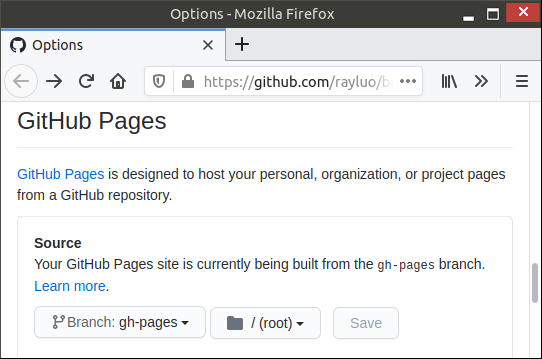

Github Page Overwriter
======================

This is a Github Action that overwrites your Github Pages branch with the content of current workdir, thus deploy/publish without polluting your repo history.

* This is a [summary of what `Github Page Overwriter` is](#what-is-it)
* If you can't wait to get started, this is the [tutorial](#how-to-use-it)
* This is an in-depth description on
  [how this `Github Page Overwriter` tool work (differently)](#how-does-it-work)
* If you are still skeptical, this is our answer to
  ["why yet another Github Page publish action"](#but-why).


What is it?
-----------

Github Page Overwriter is:

* the **simplest** possible Github Page publisher, because it requires no configuration
* the **most lightweight** Github Page publisher
  because its implementation requires no runtime dependency other than git itself.
* the **cleanest** possible Github Page publisher,
  because it is designed to leave no extra commits in your repo history
  (its deployment branch would be overwritten each time).


How to use it?
--------------

1.  Github Page Overwriter requires no mandatory configuration.
    You simply add it as one extra step into your own github action.

    ```yaml
    name: Your github action

    on:
      push:
        branches:
          # NOTE: You may want to limit the trigger branch to be "main" or "master" etc.
          - '*'

    jobs:
      publish:
        runs-on: ubuntu-latest
        steps:
          - name: Check out
            uses: actions/checkout@v2

          - name: Generate your content
            run: echo "Optional placeholder. Put your project's static website generator command here."

          - name: Publish current workdir (which contains generated content) to GitHub Pages
            uses: rayluo/github-pages-overwriter@v1.1

            with:

              # Optional. Default value "." means the root directory of your project will be published.
              # You can use whatever directory your project uses, for example "wwwroot".
              # Such a directory does *not* have to already exist in your repo,
              # it could be an output directory created dynamically by your static website builder.
              source-directory: .

              # Optional. Default value "gh_pages".
              # It specifies the temporary branch which hosts the static website.
              # Each build will OVERWRITE this branch.
              target-branch: gh_pages
    ```


2.  In your Github Pages setting, choose your publish source like this:

    | Github Page Overwriter settings | Github Pages settings |
    | ------------------------------- | --------------------- |
    | `source-directory` can be any directory you choose | *Always* choose folder `/ (root)` for your publishing source, regardless of what `source-directory` is.  |
    | `target-branch` can be any branch that match the setting on the right | Choose any branch that matches the `target-branch` setting on the left |


How does it work?
-----------------

Behind its simplest usage pattern,
Github Page Ovewriter is based on a sophisticated Version Control System philosophy:

1. Your repo stores the history of your project's source code and assets.
2. Any artifact that can be built from a snapshot of those source code and assets,
   should **not** be stored inside the repo history.

Yet, in order to take advantage of the free hosting service of Github Pages,
those artifacts would need to be stored inside a repo, thus violating tenet 2 above.
Some publisher actions work around this by pushing the artifacts into a dummy repo
which is only used for hosting the static website.
That's fine, but you'd need to provision a personal access token (PAT) for it,
and then configure your Github Action to use the PAT.

Github Page Overwriter takes a simpler approach.
The artifact will be forcefully pushed into - thus overwrite - the `gh-pages` branch
inside your same main repo.
This way, that publish commit would be overwritten each time,
thus won't become part of your repo's long term history.

1. For example, your repo starts like this when you are ready for the first publish:

   ```
    D---E---F  main
   ```

2. Trigger this action once, your repo would look like:

   ```
              A  gh-pages
             /
    D---E---F  main
   ```

3. Later you added more work into your repo, and now ready for a new publish.

   ```
              A  gh-pages
             /
    D---E---F---G---H  main
   ```

4. Trigger this action one more time, your repo would look like:

   ```
                      A'  gh-pages
                     /
    D---E---F---G---H  main
   ```


But why?
--------

Why yet another new Github Pages deployment tool? What is its uniqueness?

I did look around. But the following reasons made me start this `Github Pages Overwriter` project.

1.  The What (What it does, or does not do)

    I prefer a git tenet of never store build artifacts inside a repo
    (at least not store as part of the permanent history).
    Some existing github actions possibly also satisfy that,
    but none of them explicitly promises such behavior in their contract (i.e. their doc).

    In this project, not only it is named “Github Page OVERWRITER”
    which hints that the generated content would be ephemeral and overwritten in next deployment;
    it also documented such commitment in its [“how does it work” section](#how-does-it-work).

    In order to examine whether an existing Github Pages deployment action satisfies the aforementioned tenet,
    I’d need to look into their implementation.
    But, many of them turn out to be implemented by one programming language or another,
    running in some sort of container/runner.
    I certainly do not know all existing languages,
    so I cannot easily review any given 3rd-party github action.
    This brings me to my next point.


2.  The How (How it is implemented)

    To satisfy tenet in #1, one only needs to run several git commands in the right way,
    without much external dependency.
    Feel free to look into the “Github Page Overwritter” source code to see
    how it only uses git command line tool to achieve that.
    Personally, it took me less time to write a new action to do what I want,
    then to sieve through existing actions to see whether one of them happens to suit my need.

3.  The Security.

    Any 3rd-party github action could potentially mess up with your central repo.
    [Security concern on github action is a real thing](https://github.community/t/are-github-actions-safe-to-use/17895).
    The only way to be sure, is to review their implementation.
    This is another reason why “#2 how it is implemented” is important.
    I feel more comfortable to trust an action that I can fully understand what it works.
    So should you.

4.  The Simplicity.

    Based on #1 and #2, there is really not much to configure.
    A simpler configuration means easier to get started.

    For example, Github Page Ovewriter does not require any github token to be configured.

